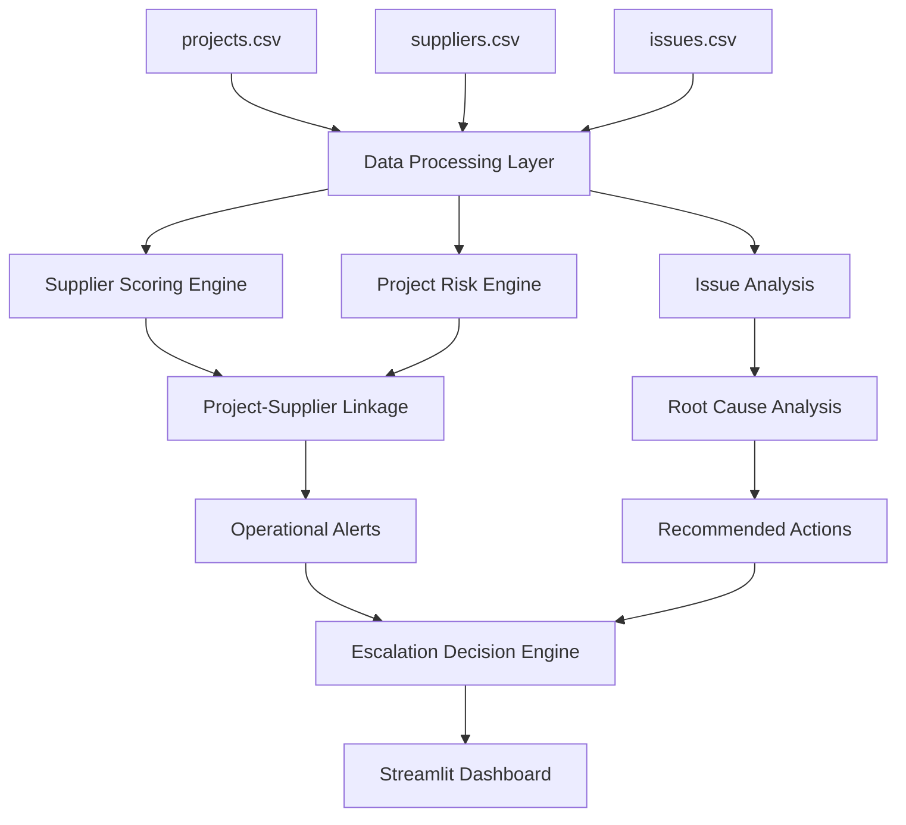

# Operational Intelligence Dashboard

A Python-based operational decision-support platform that analyzes project delivery risk, supplier performance, operational incidents, and escalation workflows across a portfolio of infrastructure projects.

Built using Python, Pandas, Plotly, and Streamlit.

## Overview

The Operational Intelligence Dashboard is a decision-support platform designed to help operations teams monitor project delivery performance, supplier reliability, operational risks, and issue escalation across a portfolio of infrastructure projects.

Rather than focusing solely on reporting metrics, the dashboard combines project data, supplier performance data, and operational issue tracking to identify risks, explain root causes, and recommend corrective actions.

The project demonstrates how operational data can be transformed into actionable insights that support prioritization and resource allocation.

## 🚀 Live Demo

Explore the live Operational Intelligence Dashboard:

[🔗 Launch Dashboard](https://operational-intelligence-dashboard-3wftctepdwa2f4zapmuyzx.streamlit.app/)

## Dashboard Highlights

### Executive Overview

## Supplier Intelligence

## Operational Risk Insights

### Root Cause Analysis & Escalation Engine

## Business Problem

Operations teams often manage dozens of projects, suppliers, budgets, and operational incidents simultaneously.

As portfolios scale, it becomes increasingly difficult to answer questions such as:

* Which projects require immediate attention?
* Which suppliers are contributing to delivery risk?
* What operational issues are driving project delays?
* Which risks should be escalated to leadership?
* Where should resources be allocated first?

Without a centralized view, teams often react to problems after delays and cost overruns have already occurred.

This dashboard was built to address that challenge.

## Key Features

### Executive Overview

Provides a portfolio-level view of:

* Total Projects
* Active Projects
* Delayed Projects
* Portfolio Budget
* Budget Variance
* Average Completion Percentage

### Supplier Intelligence

Evaluates suppliers using a weighted scoring methodology based on:

* Delivery Reliability
* Cost Consistency
* Quality Score
* Responsiveness Score

Suppliers are classified as:

* Recommended
* Monitor
* High Risk

### Operational Risk Insights

Identifies projects requiring intervention through a risk scoring model based on:

* Schedule Risk
* Issue Risk
* Completion Risk
* Cost Risk

The dashboard highlights:

* Highest Risk Projects
* Operational Issue Trends
* High Severity Issues
* Operational Alerts

### Root Cause Analysis

For high-risk projects, the dashboard automatically identifies:

* Primary Operational Drivers
* Risk Breakdown
* Recommended Actions

### Operational Escalation Engine

Projects are automatically assigned escalation decisions using predefined operational rules.

Examples include:

* Executive Escalation
* Schedule Recovery Plan
* Supplier Performance Review
* Issue Resolution Task Force

Each recommendation includes an explanation of why the action was generated.

## Risk Methodology

The dashboard uses a rule-based operational risk model.

### Schedule Risk

Calculated using project delay days.

### Issue Risk

Calculated using the number of unresolved operational issues.

### Completion Risk

Calculated using remaining project completion percentage.

### Cost Risk

Calculated using budget variance.

### Final Risk Score

The final risk score combines:

* Schedule Risk (40%)
* Issue Risk (30%)
* Completion Risk (20%)
* Cost Risk (10%)

Scores are normalized and capped to improve interpretability.

The objective is prioritization rather than prediction.

## System Architecture

## Technology Stack

* Python
* Pandas
* NumPy
* Plotly
* Streamlit

## Dataset

The project uses simulated operational data inspired by real-world project management, procurement, supplier evaluation, and operational reporting workflows.

The dataset includes:

* 50 Projects
* 30 Suppliers
* 150+ Operational Issues

No confidential company data has been used.

## Limitations

This project uses simulated data and rule-based scoring models.

In production environments, additional factors such as:

* Historical project performance
* Resource availability
* Procurement lead times
* Financial forecasts
* Predictive analytics

would be incorporated into the decision-making process.

## Future Improvements

Potential future enhancements include:

* Predictive Risk Forecasting
* Supplier Impact Modelling
* Automated Alert Notifications
* Interactive Scenario Analysis
* Workflow Integration with Operational Systems

## Author

Mehuli Basu
